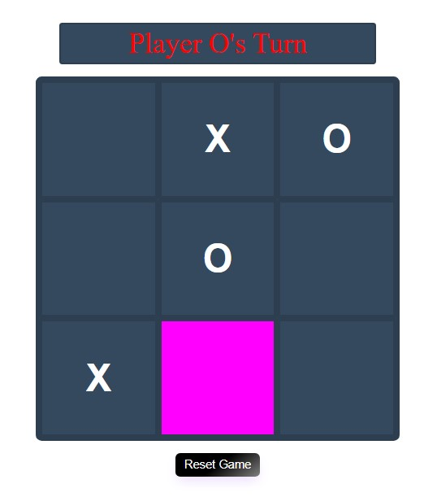

# Tic-Tac-Toe
Tic-Tac-Toe game

  

  

## <ins>What it does

Tic-Tac-Toe allows two players to place either an X or an O in one of 9 squares on each turn.  3 in a row in any direction wins.  The game has a reset game button that allows the players to reset the game at any time.  If there is a winner an alert with an OK button will declare the winner or a tie.  Once OK is press on the alert the game resets.

## <ins>How to Run

Clone Repo into editor => Open terminal in VS Code or other editor => run "npm start" for live server

  Once installed you begin the game by clicking on any square.  By default it starts with "O".  Player two selects a square for "X".  3 in a row in any direction wins.  Hit reset button to reset game in the middle of the game.  Once winner is declared by alert message the game resets after OK is clicked.  The Header keeps track of who's turn it is and a square when selected is highlighted pink.

## <ins>Future improvements

I would like to add some animation to this.  Have the winner declared as a seperate div that apears once there is a winner instead of an alert.  Also have the X and O text different colors of the players choice.  Having the functionality to play single player would be nice too.

## <ins>License

MIT License

Copyright (c) 2022 Jeremy Duval

Permission is hereby granted, free of charge, to any person obtaining a copy
of this software and associated documentation files (the "Software"), to deal
in the Software without restriction, including without limitation the rights
to use, copy, modify, merge, publish, distribute, sublicense, and/or sell
copies of the Software, and to permit persons to whom the Software is
furnished to do so, subject to the following conditions:

The above copyright notice and this permission notice shall be included in all
copies or substantial portions of the Software.

THE SOFTWARE IS PROVIDED "AS IS", WITHOUT WARRANTY OF ANY KIND, EXPRESS OR
IMPLIED, INCLUDING BUT NOT LIMITED TO THE WARRANTIES OF MERCHANTABILITY,
FITNESS FOR A PARTICULAR PURPOSE AND NONINFRINGEMENT. IN NO EVENT SHALL THE
AUTHORS OR COPYRIGHT HOLDERS BE LIABLE FOR ANY CLAIM, DAMAGES OR OTHER
LIABILITY, WHETHER IN AN ACTION OF CONTRACT, TORT OR OTHERWISE, ARISING FROM,
OUT OF OR IN CONNECTION WITH THE SOFTWARE OR THE USE OR OTHER DEALINGS IN THE
SOFTWARE.

